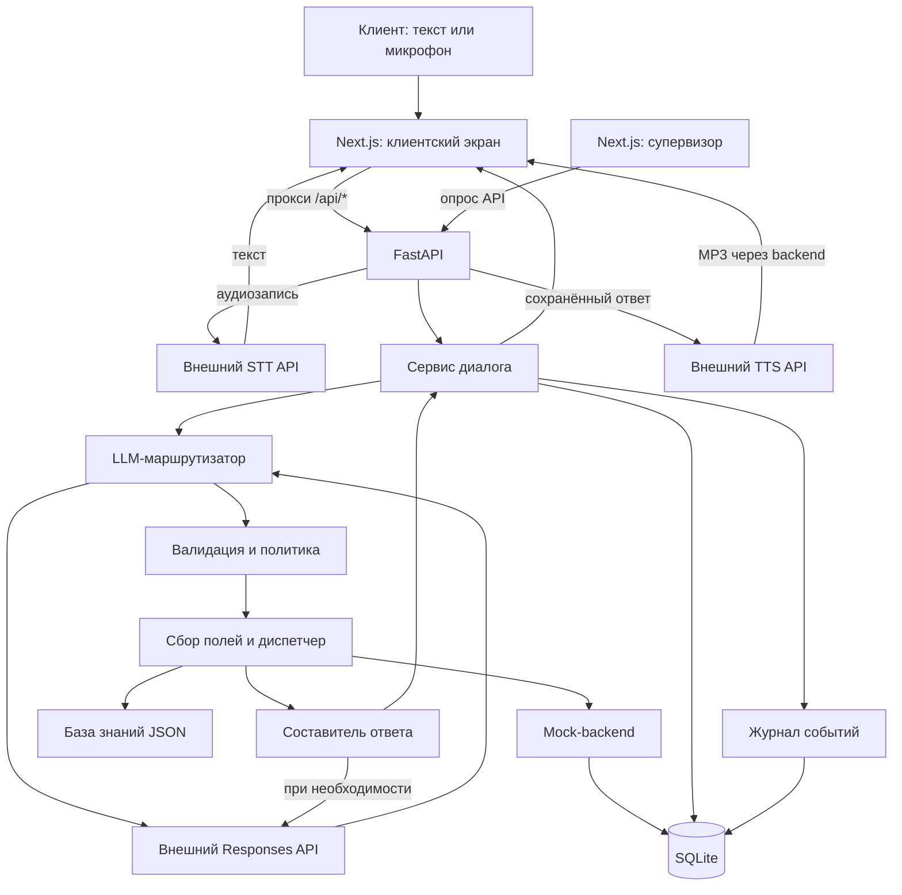

# Halyk CallAI

Текстовый и голосовой помощник по страхованию на русском и казахском языках. Он определяет задачу клиента, уточняет сведения и выполняет демонстрационные операции; супервизор видит маршрут, основания решения и результат.

## 2. О проекте

Клиент может описать проблему своими словами: например, деньги списались, а полис не пришёл. Ассистент должен различить похожие ситуации, собрать данные и продолжить нужный сценарий, сохраняя контекст разговора.

Проект предназначен для клиента страхового контакт-центра и супервизора. Клиент получает справочный ответ, уточняющий вопрос или результат операции в демо-системе. AI понимает свободную речь, выбирает сценарий и извлекает данные; правила исполнения проверяются отдельно в backend.

**Это локальный прототип.** Страховые сведения относятся к вымышленной **Saqta Insurance** из набора данных. Реальные системы страховой компании и банка не подключены. Для IP-телефонии реализован отдельный экспериментальный адаптер **Asterisk AudioSocket**; реальный телефонный звонок ещё не проверен, адаптер выключен по умолчанию. Подробности — в разделе «Данные и интеграции».

## 3. Что реализовано

### Для клиента

- Чат с выбором RU/KK, историей и восстановлением последней сессии в браузере.
- Голосовой ввод отдельными репликами и озвучивание ответа; микрофон может прервать воспроизведение.
- Уточнение запроса, сбор обязательных полей, исправление сведений и возврат к предыдущей теме.
- Предпросмотр и отдельное подтверждение операций, помеченных в каталоге как необратимые.
- Шесть встроенных демо: офис, проблема оплаты, исправление сведений, возврат к теме, подтверждение действия и запрос на казахском.

### Обработка и наблюдение

- Каталог из 40 бизнес-сценариев и 3 системных намерений: непонятный запрос, вопрос вне компетенции и прощание.
- Проверка структурированного ответа LLM, источников, цитат и извлечённых полей.
- Детерминированные правила выбора маршрута и работы с несколькими темами.
- Mock-операции: поиск клиента и полиса, расчёты по тестовым тарифам, изменение контактов, работа с полисами и обращениями, запись демонстрационных уведомлений.
- SQLite для разговоров, операций, состояния mock-данных и событий; защита от повторного выполнения по идентификатору операции.
- Пульт супервизора: сценарий, альтернативы, различающие факты, цитаты, состояние до/после, вызовы backend, источники и время обработки.

## 4. Как работает решение

1. Клиент вводит текст или записывает реплику. Запись отправляется после остановки микрофона.
2. Голос преобразуется в текст через STT. Текстовый запрос сразу поступает в `/api/chat`.
3. Backend загружает историю, текущую тему, собранные поля и результаты предыдущих операций.
4. LLM предлагает сценарии, данные и основания выбора. Валидатор проверяет структуру и источники; политика определяет следующий шаг.
5. Система уточняет запрос, собирает недостающие поля либо вызывает mock-backend и базу знаний. Для защищённых операций ожидает подтверждения.
6. Составитель ответа использует шаблон либо отдельный LLM-вызов по полученным фактам. Ответ и состояние сохраняются в SQLite.
7. Клиент видит текст; для голосового запроса дополнительно воспроизводится AI-речь. Супервизор получает журнал обработки.

## 5. Инструкция по использованию

### Текстовый разговор

1. Откройте **[http://127.0.0.1:3000](http://127.0.0.1:3000)** — основной клиентский экран.
2. Выберите **RU** или **KK** справа вверху.
3. Нажмите **«Новый разговор»**, чтобы начать отдельную сессию.
4. Введите вопрос в поле **«Сообщение»** и нажмите стрелку отправки или Enter. Например: `Где находится ваш офис в Алматы?`.
5. Дождитесь ответа в ленте. Если ассистент запрашивает данные, отправьте их следующим сообщением.
6. Если появилась панель подтверждения, проверьте параметры и нажмите **«Подтвердить»**. Изменения применяются только к демо-данным.
7. По ссылке **«Пульт супервизора»** откройте разбор разговора. Выберите разговор и ход в списках; данные обновляются каждые 2,5 секунды.

Кнопка демо сама создаёт новую сессию и отправляет первую реплику. В многошаговых примерах следующую реплику отправляет кнопка **«Следующая реплика демо →»**.

### Голосовой разговор

1. Убедитесь, что отображается **«Голос настроен»**. Индикатор означает наличие конфигурации, а не проверку доступа к провайдеру.
2. Выберите язык, нажмите микрофон и разрешите браузеру доступ к нему.
3. Произнесите вопрос. Нажмите **■**, чтобы закончить запись и отправить её на распознавание.
4. Распознанная реплика и ответ появятся в чате; ответ будет озвучен AI-голосом.
5. Повторное нажатие микрофона прерывает озвучивание и начинает следующую запись. При недоступности голоса можно продолжить текстом.

Это запись отдельных реплик, а не непрерывный телефонный звонок. Для завершения диалога можно отправить «До свидания»; отдельной кнопки завершения звонка нет. **«Новый разговор»** начинает новую сессию, не удаляя предыдущую.

## 6. Технологический стек

| Компонент | Технология | Назначение |
| --- | --- | --- |
| Интерфейс | Next.js 15, React 19, TypeScript, Tailwind CSS 4 | Чат и пульт супервизора |
| Backend | Python 3.12+, FastAPI, Pydantic, Uvicorn | API, контракты и обработка диалога |
| HTTP-клиент | HTTPX | Вызовы внешнего AI API |
| LLM | `gpt-6-astra`, `POST /responses` | Маршрутизация; часть ответов по фактам |
| STT | `whisper-1`, `POST /audio/transcriptions` | Распознавание записанной реплики |
| TTS | `gpt-4o-mini-tts`, `POST /audio/speech` | Синтез MP3; в `.env.example` голос `marin` для RU и KK |
| Хранение | SQLite через `sqlite3`, JSON, JSONL | Сессии, mock-операции, каталог, база знаний, события |
| Аудио браузера | MediaRecorder, MediaSource, резервное воспроизведение полного файла | Запись, потоковое воспроизведение и прерывание |
| Экспериментальная IP-телефония | Отдельный адаптер Asterisk AudioSocket, PCM 8 кГц, опциональный ffmpeg | Подключение к существующим STT/chat/TTS API; реальный звонок пока не проверен |
| Инфраструктура и тесты | PowerShell, Docker Compose для backend, pytest, Node.js test runner | Локальный запуск и проверки |

Названия AI-моделей подтверждаются телами запросов в коде. Доступность по конкретному ключу и адресу API требует отдельной проверки. Локальные AI-модели, embeddings, reranker и компьютерное зрение в рабочем pipeline не используются.

## 7. Архитектура



- **Frontend** отправляет запросы на свой `/api/*`; Next.js перенаправляет их на `127.0.0.1:8000`. Ключи остаются на backend.
- **Маршрутизатор** получает каталог, историю и текущую реплику; сам операции не выполняет.
- **Политика и диспетчер** проверяют маршрут, собирают поля и управляют подтверждением и выполнением.
- **Mock-backend и база знаний** дают факты и сохраняют демонстрационные изменения.
- **Составитель ответа** отделён от маршрутизации. Голосовой слой озвучивает уже сохранённый ответ.
- **Супервизор** показывает события обработки и источники, а не скрытые рассуждения модели.

## 8. Структура проекта

```text
.
├── backend/app/
│   ├── catalog/           # Загрузка и проверка каталога
│   ├── router/            # LLM-запросы, промпт и валидация
│   ├── policy/            # Правила маршрутизации и тем
│   ├── state/             # Сервис диалога и SQLite
│   ├── slots/             # Сбор и исправление полей
│   ├── actions/           # Диспетчер и mock-backend
│   ├── kb/                # Доступ к базе знаний
│   ├── response/          # Формирование ответа
│   ├── voice/             # STT, TTS, нормализация речи
│   └── observability/     # Журнал событий
├── backend/tests/         # Модульные и интеграционные тесты
├── frontend/              # Чат, супервизор, аудиотесты
├── scripts/               # Запуск и проверочные сценарии
├── golden/L2/             # Зафиксированное ядро и копия датасета
├── evaluation/            # Оценка маршрутизации и отчёты
├── experimental/asterisk/ # Изолированный адаптер IP-телефонии, тесты и отдельный Compose
├── data/                  # Сохранённый скомпилированный каталог
├── docs/                  # Документация голоса и изображения
├── .env.example           # Шаблон без ключей
├── pyproject.toml         # Python-зависимости
├── requirements.lock      # Ограничения версий Python-пакетов
├── Dockerfile             # Образ backend
└── docker-compose.yml     # Запуск только backend
```

## 9. Установка и запуск

### Требования

- Python **3.12+**, согласно `pyproject.toml`.
- Node.js и npm. Совместимый вариант для зависимостей из lock-файла — **Node.js 20.9+**; отдельной фиксированной версии Node в проекте нет.
- Windows PowerShell для общего скрипта запуска. При ручном запуске Python и npm запускаются отдельно.
- Сеть для установки пакетов и AI-запросов; ключ и API с доступом к указанным моделям.
- Свободные порты **3000** и **8000**, браузер с микрофоном для голосового демо.

Отдельный сервер БД и GPU не требуются. Docker для локального запуска не обязателен.

### Клонирование

```powershell
git clone https://github.com/BAITC-Hacks/hack-cd37b294-qamqor-ai.git
cd hack-cd37b294-qamqor-ai
Copy-Item .env.example .env
```

### Переменные окружения

Откройте `.env` и заполните `OPENAI_API_KEY` своим ключом. `CALLAI_DATASET_PATH` можно оставить пустым: встроенный датасет выбирается автоматически. При необходимости путь можно переопределить:

```dotenv
CALLAI_DATASET_PATH=golden/L2/case_2/voice_router_dataset
```

Явно заданный относительный путь выше работает при запуске из корня проекта. Дефолтный путь вычисляется от расположения проекта и не зависит от рабочего каталога.

**По умолчанию** приложение использует включённый в Git каталог `golden/L2/case_2/voice_router_dataset`. Отдельный внешний датасет для запуска не нужен.

| Переменная | Назначение | Обязательная |
| --- | --- | --- |
| `OPENAI_API_KEY` | Ключ LLM; по умолчанию также аудио | Да, для обработки запросов клиента |
| `OPENAI_BASE_URL` | Адрес API; по умолчанию `https://api.openai.com/v1` | Если используется другой совместимый сервис |
| `CALLAI_MODEL` | `gpt-6-astra` для маршрутизации и составления ответов | Оставить это значение: обычный запуск запрещает другую модель |
| `CALLAI_DATASET_PATH` | Переопределение каталога JSON-файлов и `evaluate.py` | Нет; по умолчанию встроенный `golden/L2/case_2/voice_router_dataset` |
| `CALLAI_TIMEOUT_SECONDS` | Тайм-аут LLM, по умолчанию 90 секунд | Нет |
| `CALLAI_DATABASE` | Путь SQLite | Нет; фактический путь по умолчанию — `backend/runtime/callai.sqlite` |
| `CALLAI_VOICE_ENABLED` | Включение голосовых API | Нет; по умолчанию `true` |
| `CALLAI_VOICE_API_KEY`, `CALLAI_VOICE_BASE_URL` | Отдельные ключ и адрес аудиосервиса | Нет; наследуются настройки `OPENAI_*` |
| `CALLAI_STT_MODEL` | Модель распознавания, `whisper-1` | Нет |
| `TTS_PROVIDER`, `TTS_MODEL` | Провайдер `openai`, модель `gpt-4o-mini-tts` | Нет; другие провайдеры код не поддерживает |
| `TTS_VOICE_RU`, `TTS_VOICE_KK` | Голоса; в шаблоне оба `marin` | Нет; резерв — `CALLAI_TTS_VOICE`, затем `coral` |
| `TTS_SPEED`, `TTS_INSTRUCTIONS` | Скорость 1.0 и дополнительные инструкции речи | Нет |
| `CALLAI_EVAL_CONCURRENCY` | Параллельность оценочного запуска, по умолчанию 2 | Нет |
| `TELEPHONY_ENABLED` | Разрешение запуска отдельного экспериментального адаптера; по умолчанию `false`, в том числе при отсутствии переменной | Нет; Web Demo не зависит от телефонии |

`CALLAI_TTS_MODEL` и `CALLAI_TTS_VOICE` сохранены как резервные настройки; `TTS_MODEL` и языковые `TTS_VOICE_*` имеют приоритет. Переменные процесса имеют приоритет над `.env`. Не добавляйте `.env` в Git.

Для обычного демо оставьте `TELEPHONY_ENABLED=false`. Основной backend не запускает адаптер даже при `true`; эксперимент запускается отдельной командой и читает переменные процесса, без автоматической загрузки `.env`. Инструкция — [experimental/asterisk/SETUP.md](experimental/asterisk/SETUP.md).

### Общий запуск на Windows

Из корня проекта:

```powershell
powershell -NoProfile -ExecutionPolicy Bypass -File .\scripts\run.ps1 demo
```

Политика исполнения задаётся только для этого процесса PowerShell. Скрипт создаёт `.venv`, устанавливает Python-зависимости, выполняет `npm ci` при отсутствии `node_modules`, собирает frontend, запускает backend и `next start`. Не запускайте второй экземпляр поверх уже работающего. Для остановки используйте Ctrl+C; скрипт завершает запущенный им backend.

| Адрес | Назначение |
| --- | --- |
| [http://127.0.0.1:3000](http://127.0.0.1:3000) | Клиентский экран |
| [http://127.0.0.1:3000/supervisor](http://127.0.0.1:3000/supervisor) | Пульт супервизора |
| [http://127.0.0.1:8000/docs](http://127.0.0.1:8000/docs) | Интерактивная документация API |
| [http://127.0.0.1:8000/health](http://127.0.0.1:8000/health) | Состояние приложения |
| [http://127.0.0.1:8000/ready](http://127.0.0.1:8000/ready) | Наличие конфигурации; доступ к AI API не проверяет |

### Раздельный запуск на Windows

Первый терминал, из корня проекта:

```powershell
python -m venv .venv
.\.venv\Scripts\python.exe -m pip install -e '.[test]' -c requirements.lock
.\.venv\Scripts\python.exe -m uvicorn app.main:app --host 127.0.0.1 --port 8000
```

Второй терминал, также из корня проекта:

```powershell
cd frontend
npm.cmd ci
npm.cmd run build
npm.cmd run start
```

`npm.cmd` позволяет запускать npm на Windows без исполнения `npm.ps1`. Для разработки в `package.json` также предусмотрен `npm run dev`.

### Что даёт Docker

В репозитории предусмотрена команда:

```bash
docker compose up --build
```

Но текущий Compose поднимает **только backend** на `127.0.0.1:8000`. Он монтирует встроенный `./golden/L2/case_2/voice_router_dataset` в `/data/starter_kit`: значение `CALLAI_DATASET_PATH` из `.env` не меняет этот bind mount. Frontend запускается отдельно. Compose передаёт только перечисленные в нём LLM-настройки и путь датасета; голосовые настройки из `.env`, включая `marin`, автоматически в контейнер не попадают. Том SQLite не настроен. Docker-запуск в рамках аудита не проверялся.

## 10. Быстрый запуск для жюри

Нужны Python 3.12+, Node.js/npm и доступ к AI API. В PowerShell:

```powershell
git clone https://github.com/BAITC-Hacks/hack-cd37b294-qamqor-ai.git
cd hack-cd37b294-qamqor-ai
Copy-Item .env.example .env
```

В `.env` заполните **`OPENAI_API_KEY`**, при необходимости **`OPENAI_BASE_URL`**. `CALLAI_DATASET_PATH` оставьте пустым: встроенный датасет выбирается автоматически.

Затем:

```powershell
powershell -NoProfile -ExecutionPolicy Bypass -File .\scripts\run.ps1 demo
```

Откройте **[http://127.0.0.1:3000](http://127.0.0.1:3000)**. Без доступного LLM API интерфейс можно открыть, но даже текстовый демо-запрос не будет обработан. Сервис должен поддерживать `gpt-6-astra`, структурированный ответ и параметры кэширования из кода.

## 11. Как проверить решение — демо для жюри

### Сценарий: изменение контакта с исправлением и подтверждением

Используются тестовый клиент из `mock_backend.json` и реплики встроенных демо и `scripts/live_acceptance.py`.

**Шаг 1.** Откройте клиентский экран, выберите RU и нажмите **«03 · Исправить сведения»**. Будет отправлено:

```text
Хочу поменять email, ИИН 850314300121. Новый адрес first@example.com
```

**Шаг 2.** Дождитесь предложения подтвердить действие. Пока не подтверждайте. Нажмите **«Следующая реплика демо →»**, чтобы отправить:

```text
Нет, ошибся: новый email second@example.com
```

**Шаг 3.** Убедитесь, что новое предложение содержит `second@example.com`, затем нажмите **«Подтвердить»**.

**Шаг 4.** Откройте **«Пульт супервизора»**. Выберите ход исправления, затем ход подтверждения. Посмотрите поля, ожидаемую операцию и блок **Mock backend**.

### Ожидаемый результат

- До подтверждения ассистент предлагает изменение, а не сообщает об уже выполненной операции.
- Новое значение заменяет старое; прежнее подтверждение становится недействительным.
- После подтверждения чат сообщает об обновлении контакта в демо-системе. В журнале вызов `update_contact` содержит `new_value: second@example.com`, ожидаемая операция очищена.
- Изменение сохраняется в локальной SQLite; реальная почта не отправляется.

Выбор маршрута зависит от LLM: точная формулировка не гарантируется. Если данных недостаточно, ответьте на уточнение; при ошибке API сначала проверьте конфигурацию.

Для дополнительной проверки голоса выберите KK и запишите: `Алматыдағы кеңсеңіз қайда орналасқан? Қазақша жауап беріңізші.` Ожидается ответ об офисе из базы знаний с озвучиванием. В тестовой записи указаны `Abai Ave 150` и `Mon-Fri 09:00-18:00, Sat 10:00-15:00`; это сведения вымышленной компании.

## 12. API

| Метод | Endpoint | Назначение |
| --- | --- | --- |
| GET | `/health`, `/ready` | Состояние и наличие LLM-конфигурации |
| POST | `/api/session` | Создать сессию с `language: ru` или `kk` |
| GET | `/api/session/{conversation_id}` | История и состояние |
| POST | `/api/chat` | Обработать реплику и допустимые mock-действия |
| POST | `/api/route` | Маршрутизация без выполнения операций |
| GET | `/api/supervisor/sessions` | Последние сессии |
| GET | `/api/supervisor/session/{conversation_id}` | Состояние и события разговора |
| GET | `/api/voice/status` | Конфигурация голоса без проверки доступа к провайдеру |
| POST | `/api/voice/transcribe?language=ru` | Распознать аудио из тела запроса |
| POST | `/api/voice/speech?stream=true` | Озвучить сохранённый ход по `conversation_id` и `turn_id` |

Минимальный пример для bash/curl. Сначала создайте сессию:

```bash
curl -X POST http://127.0.0.1:8000/api/session \
  -H 'Content-Type: application/json' \
  -d '{"language":"ru"}'
```

Подставьте возвращённый `conversation_id`:

```bash
curl -X POST http://127.0.0.1:8000/api/chat \
  -H 'Content-Type: application/json' \
  -d '{"conversation_id":"<conversation_id>","turn_id":"demo-1","text":"Где находится ваш офис в Алматы?","language":"ru"}'
```

Ответ содержит `text`, `language`, `state_version`, `pending_action`, `citations` и `latency`. Для новой реплики используйте новый `turn_id`. Подтверждение требует `confirm_operation_id` из предложения и актуального `expected_state_version`. Схемы доступны в `/docs`.

## 13. Данные и интеграции

- **`golden/L2/case_2/voice_router_dataset/`** — отслеживаемая Git копия данных: сценарии, поля, действия, база знаний, mock-клиенты/полисы/платежи/обращения, 104 оценочные реплики, 10 примеров диалогов и `evaluate.py`.
- **`knowledge_base.json`** — продукты, тестовые тарифы, офисы, клиники и справочные сведения. Поиск по разделу и сценарию.
- **`mock_backend.json`** — начальное состояние демо. Копируется в SQLite при первом создании БД; исходный JSON не изменяется.
- **`backend/runtime/callai.sqlite`** — фактический путь БД по умолчанию. События также дописываются в соседний `callai.events.jsonl`. Отдельного инструмента миграций нет: таблицы создаются кодом при старте.
- **Внешний AI API** — внешняя интеграция действующего Web Voice pipeline. Адрес по умолчанию — OpenAI; можно настроить совместимый адрес.
- **Уведомления, передача оператору и запись на приём** — записи в mock-данных. Реальной отправки SMS/email, передачи звонка оператору, CRM и подключения к календарю нет.

### IP-телефония: экспериментальный адаптер Asterisk

**Реализован программный адаптер для подключения Asterisk к CallAI через AudioSocket.** Он обращается к существующим API: создаёт сессию, передаёт завершённую реплику в STT, отправляет текст в общий сервис диалога и возвращает TTS-аудио. Маршрутизация, сценарии и STT/TTS остаются общими с Web Voice.

В адаптере реализованы обработка PCM 8 кГц, выделение реплики по паузе, последовательная обработка ходов и остановка устаревшего аудио при перебивании. Подготовлены отдельная конфигурация Asterisk и Compose для локального тестового звонка. **60 тестов** проверяют протокол, аудио и изоляцию ошибок; тесты TCP используют локальные соединения и подменённые HTTP-ответы, а не работающую АТС.

Статус подключения: **реальный звонок Asterisk/SIP/PSTN не выполнен**. В проверенном окружении Docker Engine недоступен, ffmpeg не найден. SIP-аккаунт, телефонный номер, ARI и передача живому оператору не настроены. Телефонное подтверждение операций также не реализовано: для него остаётся существующая кнопка Web UI.

`TELEPHONY_ENABLED=false` — значение по умолчанию. Адаптер работает отдельным процессом; его отсутствие или сбой не мешает запуску backend и Web Voice. Для основного демо не нужны Asterisk, ARI, SIP или telephony bridge. Экспериментальная телефония пока не входит в список готовых возможностей для показа звонка жюри.

[Инструкция по отдельному запуску](experimental/asterisk/SETUP.md) · [Выполненные проверки и ограничения](experimental/asterisk/STATUS.md).

## 14. AI-компонент

| Этап | Вход | Выход |
| --- | --- | --- |
| STT, `whisper-1` | Аудиофайл и язык | Распознанный текст |
| Маршрутизатор, `gpt-6-astra` | Каталог, история, поля, факты, новая реплика | JSON: сценарии, источники, цитаты, проверки границ, обновления полей |
| Составитель, `gpt-6-astra` при необходимости | Результаты backend и записи базы знаний | JSON с ответом и идентификаторами источников |
| TTS, `gpt-4o-mini-tts` | Нормализованный сохранённый ответ, язык, голос и инструкции | MP3 целиком либо поток байтов |

Промпт находится в `backend/app/router/prompt.py`. Каталог компилируется из определений и правил; оценочные реплики, эталонные ответы и примеры диалогов в промпт не включаются.

За ход маршрутизатор делает один основной запрос и не более одного дополнительного для исправления структуры или повторного анализа. Проверяются схема, идентификаторы, цитаты и источники. Если различающего факта нет, политика выбирает уточнение. Это не гарантия отсутствия ошибок AI.

Ответ об офисе, подтверждение и ряд других ответов формируются шаблонами. Для остальных фактов составитель может вызвать LLM; затем проверяет источники и новые числовые утверждения. При неудаче возвращает сообщение о невозможности сформировать ответ.

**Векторного RAG, embeddings и reranker нет.** Есть детерминированное получение разделов JSON-базы знаний и передача фактов составителю. Function/tool calling через API не используется: модель возвращает структурированное предложение, а функции вызывает Python-диспетчер. Inference внешний. При ошибке TTS сохранённый текст остаётся доступным.

## 15. Ограничения текущей версии

- Все страховые действия и данные демонстрационные; подтверждение не создаёт реальную страховку, платёж, письмо или соединение с оператором.
- Нет production-аутентификации, разграничения доступа и проверки личности. Супервизор показывает историю и тестовые персональные данные. Локальный запуск привязан к loopback.
- Для содержательного диалога нужен внешний LLM. Полноценного автономного режима с подменой AI нет; фикстуры используются в тестах.
- `gpt-6-astra` зафиксирована проверкой при обычном старте. Совместимость провайдера с ней, `prompt_cache_options` и `prompt_cache_breakpoint` нужно проверить реальным запросом. `/ready` этого не делает.
- Web Voice работает законченными репликами: без потоковой расшифровки и автоматического определения конца речи. В экспериментальном Asterisk-адаптере есть выделение реплики по паузе, но работа телефонного канала ещё не подтверждена реальным звонком. Лимит входного аудио Web API — 20 МБ; нормализованный текст TTS свыше 4096 символов отклоняется.
- Качество казахской речи зависит от модели и записи. Автотесты не подтверждают субъективную естественность произношения.
- Даты бизнес-логики привязаны к дате датасета **2026-10-01**, а не к дате компьютера. Доступность слотов записи моделируется кодом.
- История накапливается в SQLite и передаётся маршрутизатору; суммаризация длинных разговоров не реализована.
- Docker Compose запускает только backend. Приложение, тесты и CLI по умолчанию используют встроенный датасет `golden/L2/case_2/voice_router_dataset`.

### Выполненные проверки

**Измеренные технические результаты, 23 сентября 2026 года.** Сохранённый прогон `20260923T111919_964539Z` после интеграции Golden L2, модель `gpt-6-astra`:

| Показатель | Результат |
| --- | --- |
| Основной сценарий (primary) на официальном dev-наборе | **104/104 — 100%** |
| Полное совпадение набора сценариев (full-match) | **104/104 — 100%** |
| Полнота multi-intent (recall) | **26/26 намерений — 100%**, 13 примеров |
| Full-match по языкам | RU **52/52**, KK **45/45**, mixed **7/7** |
| Средняя задержка маршрутизатора / p95 | **8,25 с / 13,13 с**, 104 измерения |
| Итоговые ошибки схемы / API / системных намерений | **0 / 0 / 0**; одна ошибка схемы исправлена повторной попыткой |

Источник: [сохранённый отчёт оценки](evaluation/integration-final-astra/20260923T111919_964539Z/baseline.json). Это результат на предоставленном dev-наборе, а не гарантия качества на новых звонках или оценка доли обращений, решённых без оператора. Время router включает повторную попытку при её наличии, но исключает политику, STT, TTS и воспроизведение. При этом обновлении README официальная оценка заново не запускалась.

При подготовке Web Demo выполнены сборка `npm.cmd run build`, валидация вложенного датасета и проверка API с этой копией и временной SQLite. После исправления дефолтного пути выполнен реальный запрос через HTTP `/api/chat` и `gpt-6-astra`: HTTP 200, сценарий `SC33`, один LLM-вызов без повторов, ответ об офисе из `get_offices` и сохранение истории.

После добавления изолированного адаптера 23 сентября 2026 года прошли **262 Python-теста**: 202 существующих backend-теста и 60 экспериментальных, а также **9 тестов аудиовоспроизведения**. Проверена конфигурация основного и отдельного экспериментального Compose; контейнеры не запускались.

Выполнены два реальных прохода **STT → router → TTS**, RU и KK, на сохранённых синтетических записях вопроса об офисе. Оба завершились успешно; язык, источники ответа, сохранение состояния и API супервизора проверены. Голос `marin` использовался для обоих языков. Полный клиентский цикл до получения всего аудио занял **15,83 с для RU** и **13,26 с для KK**; RU-ответ получен целиком, KK — потоком. Это две отдельные проверки, а не среднее время, p95, задержка до начала воспроизведения или оценка качества живой речи. Из-за разных режимов они не являются сравнением скорости RU и KK.

Источники: [отчёт pytest](evaluation/telephony/tests-final.xml), [результаты реальных голосовых запросов](evaluation/telephony/web-smoke/results.json), [проверки отключения и ошибок адаптера](evaluation/telephony/entrypoint-checks.json). Тесты с подменённым HTTP-транспортом не измеряют качество моделей.

Проверить включённую копию данных после установки зависимостей:

```powershell
.\.venv\Scripts\python.exe scripts/validate_dataset.py --dataset golden/L2/case_2/voice_router_dataset
```

Для полного pytest фикстуры используют встроенный датасет напрямую, независимо от `.env`. Запустите из корня проекта:

```powershell
.\.venv\Scripts\python.exe -m pytest -q
# Дополнительно: основной backend и изолированный эксперимент телефонии
.\.venv\Scripts\python.exe -m pytest backend/tests experimental/asterisk/tests -q
cd frontend
npm.cmd test
```

Исторические результаты находятся в `evaluation/results/` и `golden/L2/halyk-callai/evaluation/results/`. Они не заменяют новую проверку текущей версии и не измеряют качество на неизвестных данных.

## 16. Развёртывание

Публичная deployed-версия в текущем репозитории не указана.

Конфигурации CI/CD и готового production-развёртывания в отслеживаемых файлах не обнаружены. Локальные адреса выше предназначены для демонстрации на машине запуска.

## 17. Статус проекта

Реализован локальный прототип полного диалога: интерфейс → AI-маршрутизация → проверяемая бизнес-логика → mock-операция или справочный ответ → история и журнал супервизора. Есть голосовой ввод и синтез речи, подтверждение действий и сохранение состояния.

Для IP-телефонии подготовлен экспериментальный Asterisk-адаптер к тому же pipeline. Он выключен и изолирован от рабочего Web Demo; успешный реальный звонок ещё предстоит подтвердить.

Для демонстрации необходимо настроить доступ к AI API; встроенный датасет выбирается автоматически. Для реального использования потребуются настоящие интеграции, проверка личности и права доступа, подготовка инфраструктуры и отдельная проверка качества моделей.

## 18. Развитие и польза для компании

В перспективе CallAI может сократить рутинную нагрузку на контакт-центр и помогать клиентам решать страховые вопросы на русском и казахском. Сейчас это прототип с mock-операциями; эффект для компании нужно подтвердить пилотом.

| Что улучшить | Что это даст компании |
| --- | --- |
| Подключить реальные системы полисов, платежей и обращений | Ассистент сможет доводить запрос до результата: проверить оплату, найти полис, зарегистрировать обращение |
| Добавить проверку личности и права доступа | Позволит безопасно работать с персональными данными и выполнять разрешённые операции |
| Проверить Asterisk-адаптер реальным звонком, подключить SIP и передачу живому оператору вместе с контекстом | Клиенту не придётся повторять проблему; оператор получит историю и уже собранные сведения |
| Улучшить распознавание казахской и смешанной речи, работу при шуме | Сделает голосовое обслуживание доступнее и уменьшит число повторных уточнений |
| Сократить задержку ответа | Разговор станет естественнее, снизится время ожидания |
| Организовать обновление базы знаний и контроль качества | Поможет поддерживать актуальные ответы и находить причины ошибок |

Основная ожидаемая польза для компании:

- **Меньше рутинной работы операторов:** типовые вопросы сможет обрабатывать ассистент.
- **Быстрее обслуживание:** сбор данных и уточнение проблемы начнутся до подключения сотрудника.
- **Прозрачнее качество:** супервизор сможет проверять выбранный сценарий, источники и выполненные действия.
- **Удобнее обслуживание на двух языках:** единый процесс для русскоязычных и казахоязычных клиентов.
- **Возможность круглосуточного обслуживания:** после подготовки надёжной инфраструктуры и поддержки.

## 19. Предварительная оценка эффекта и план пилота

### Расчётный сценарий — допущения, не результат внедрения

Для иллюстрации масштаба возьмём **10 000 обращений в месяц** и **6 минут работы оператора на одно обращение**. Это условные входные данные, а не статистика Halyk или Saqta Insurance. Исходная нагрузка в таком примере составляет **1 000 операторских часов в месяц**.

| Допущение: доля обращений, полностью решённых без оператора | Обращения в месяц | Потенциально высвобожденные операторские часы в месяц |
| --- | --- | --- |
| 20% | 2 000 | 200 |
| 30% | 3 000 | 300 |
| 40% | 4 000 | 400 |

Формула: `обращения × доля полного решения × минуты работы оператора / 60`. В среднем сценарии: `10 000 × 30% × 6 / 60 = 300 часов в месяц`.

Это валовой потенциал по полностью решённым обращениям. Расчёт предполагает одинаковую среднюю трудоёмкость этих обращений и не учитывает затраты времени на контроль качества, повторные обращения и сопровождение. Доли 20–40% не измерены и не выводятся из точности маршрутизации на dev-наборе. Высвобождение времени не означает автоматического сокращения штата или денежной экономии.

Денежный эффект можно оценивать после пилота: стоимость действительно высвобожденного времени минус расходы на AI API, телефонию, инфраструктуру, интеграции и сопровождение. Без фактических объёмов и затрат компании сумма экономии в тенге и ROI не заявляются.

### Что измерить на пилоте

Сравнить выбранные типы обращений с исходным процессом или контрольной группой, отдельно для RU, KK и смешанной речи:

- Долю запросов, полностью решённых без оператора, с проверкой результата и повторных обращений за согласованный период.
- Время решения вопроса, время работы оператора и ожидание ответа; медиану и p95.
- Повторные обращения, ошибочные ответы и операции, причины передачи оператору.
- Стоимость одного успешно решённого вопроса с учётом AI, телефонии, инфраструктуры и участия сотрудников.
- Удовлетворённость клиента и качество распознавания в реальной телефонной записи, в том числе при шуме.

Пока таких измерений нет, обещать конкретную экономию или рост продаж нельзя.

Для жюри: **«CallAI помогает автоматизировать типовые страховые обращения, сохраняя проверяемость решений и контроль над действиями. Следующий этап — подключение реальных систем и пилот, который покажет влияние на скорость, качество и стоимость обслуживания».**
