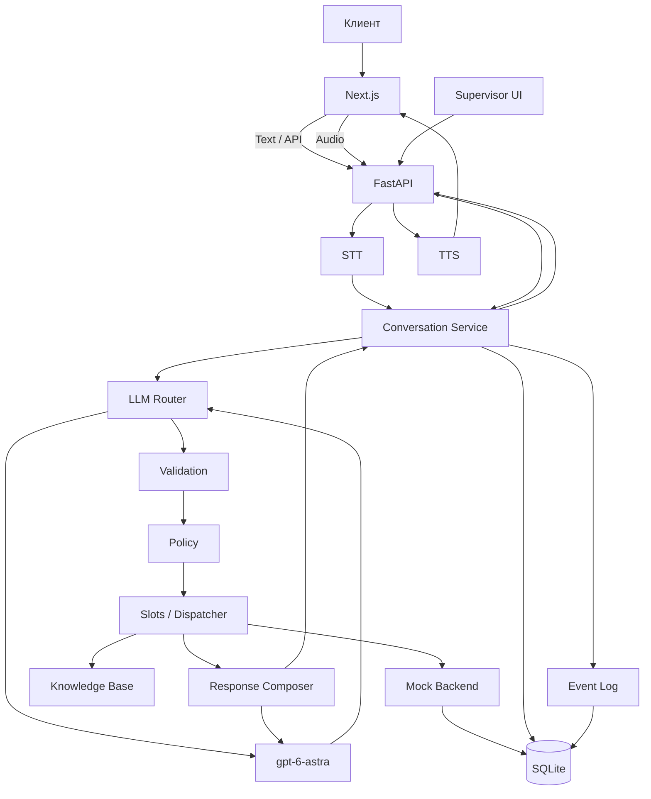

# Halyk CallAI

**AI-оператор страхового контакт-центра на русском и казахском языках.**

Halyk CallAI принимает текстовые и голосовые обращения, определяет страховой сценарий, собирает необходимые данные, выполняет контролируемые демонстрационные операции и сохраняет полный контекст диалога. Супервизор может проверить выбранный маршрут, источники, состояние диалога и выполненные действия.

---

## 1. О проекте

Клиент страховой компании может описать проблему обычными словами:

> «Деньги списались, а полис не пришёл»

или:

> «Хочу поменять email в полисе»

Ассистент должен не просто сгенерировать ответ, а:

1. понять, какой страховой сценарий соответствует обращению;
2. отличить похожие ситуации;
3. извлечь необходимые данные;
4. запросить недостающую информацию;
5. проверить бизнес-правила;
6. при необходимости запросить подтверждение;
7. выполнить допустимое действие;
8. сохранить результат и историю разговора.

Проект предназначен для двух основных ролей:

* **Клиент контакт-центра** — получает ответ, уточнение или результат операции.
* **Супервизор** — видит, как система обработала обращение, какие источники использовала и какие действия выполнила.

AI используется для понимания свободной речи, маршрутизации обращения и формирования части ответов. Выполнение операций контролируется отдельной backend-логикой.

> **Текущая версия — хакатонный прототип.** Страховые данные относятся к вымышленной **Saqta Insurance**. Реальные системы страховой компании и банка не подключены.

Для IP-телефонии реализован отдельный экспериментальный адаптер **Asterisk AudioSocket**. Его код и тесты присутствуют в репозитории, однако реальный SIP/PSTN-звонок пока не подтверждён. Телефонный модуль выключен по умолчанию и не влияет на основной Web Demo.

---

## 2. Ключевые возможности

* RU/KK текстовый AI-ассистент.
* Голосовой ввод и озвучивание ответов.
* 40 страховых бизнес-сценариев.
* 3 системных сценария.
* AI-маршрутизация через `gpt-6-astra`.
* Детерминированные бизнес-правила поверх AI.
* Сбор и исправление обязательных полей.
* Поддержка нескольких тем внутри одного диалога.
* Предпросмотр критических операций.
* Отдельное подтверждение необратимых действий.
* Mock-backend страховых операций.
* SQLite-состояние и история диалогов.
* Защита от повторного выполнения одной операции.
* Пульт супервизора.
* Источники и цитаты для AI-решений.
* RU/KK STT.
* RU/KK TTS.
* Экспериментальный Asterisk AudioSocket adapter.
* Встроенный dataset.
* Автоматические backend и audio/frontend тесты.
* Сохранённые результаты оценки маршрутизации.
* Реальные smoke-тесты LLM и voice pipeline.

---

## 3. Что реализовано

### Для клиента

* Чат с выбором **RU / KK**.
* История разговора.
* Восстановление последней сессии в браузере.
* Создание нового разговора.
* Голосовой ввод отдельными репликами.
* Озвучивание AI-ответа.
* Возможность прервать воспроизведение новой записью.
* Уточнение запроса.
* Сбор обязательных полей.
* Исправление ранее введённых данных.
* Возврат к предыдущей теме разговора.
* Подтверждение защищённых операций.

В интерфейсе доступны шесть встроенных demo-сценариев:

* офис;
* проблема оплаты;
* исправление сведений;
* возврат к теме;
* подтверждение действия;
* запрос на казахском языке.

### Обработка

В проекте реализованы:

* каталог из **40 бизнес-сценариев**;
* **3 системных намерения**:

  * непонятный запрос;
  * вопрос вне компетенции;
  * завершение разговора;
* структурированный ответ LLM;
* проверка схемы ответа;
* проверка источников;
* проверка цитат;
* извлечение полей;
* детерминированная policy-логика;
* маршрутизация нескольких тем;
* выполнение mock-операций.

### Mock-операции

Доступны демонстрационные операции:

* поиск клиента;
* поиск полиса;
* работа с оплатой;
* расчёты по тестовым тарифам;
* изменение контактных данных;
* работа с полисами;
* работа с обращениями;
* регистрация демонстрационных уведомлений.

### Супервизор

Пульт супервизора показывает:

* выбранный сценарий;
* альтернативные сценарии;
* различающие факты;
* извлечённые данные;
* цитаты;
* источники;
* состояние до обработки;
* состояние после обработки;
* backend-вызовы;
* ожидаемую операцию;
* результат;
* время обработки.

---

## 4. Как работает решение

Основной pipeline:

```text
Пользователь
    ↓
Текст / голос
    ↓
STT
    ↓
FastAPI
    ↓
LLM Router
    ↓
Validator
    ↓
Policy
    ↓
Slots / Dispatcher
    ↓
Mock Backend / Knowledge Base
    ↓
Response Composer
    ↓
TTS
    ↓
Пользователь
```

Пошагово:

1. Клиент вводит текст или записывает голосовую реплику.
2. Если используется голос, аудио отправляется в STT.
3. Распознанный текст поступает в `/api/chat`.
4. Backend загружает:

   * историю;
   * текущую тему;
   * собранные поля;
   * результаты предыдущих действий.
5. LLM предлагает:

   * сценарий;
   * извлечённые данные;
   * источники;
   * основания выбора.
6. Валидатор проверяет структуру результата.
7. Policy определяет допустимый следующий шаг.
8. Система:

   * отвечает;
   * задаёт уточнение;
   * собирает поле;
   * предлагает операцию;
   * выполняет mock-action.
9. Для защищённых операций требуется подтверждение.
10. Ответ сохраняется в SQLite.
11. При голосовом взаимодействии ответ передаётся в TTS.
12. Супервизор получает журнал обработки.

---

## 5. Почему это не просто чат-бот

Halyk CallAI не передаёт LLM полный контроль над бизнес-операциями.

Архитектура разделяет:

```text
AI interpretation
        ↓
Validation
        ↓
Business Policy
        ↓
Python Dispatcher
        ↓
Operation
```

LLM предлагает структурированное решение, но сам не выполняет операции.

Перед выполнением система отдельно проверяет:

* идентификатор сценария;
* структуру ответа;
* обязательные поля;
* источники;
* состояние диалога;
* необходимость подтверждения;
* допустимость операции.

Такой подход позволяет использовать AI для понимания естественного языка, сохраняя контролируемое выполнение бизнес-действий.

---

## 6. Инструкция по использованию

### Текстовый разговор

1. Откройте:

```text
http://127.0.0.1:3000
```

2. Выберите **RU** или **KK**.

3. Нажмите:

```text
Новый разговор
```

4. Введите сообщение:

```text
Где находится ваш офис в Алматы?
```

5. Отправьте сообщение.

6. Если системе требуется дополнительная информация — ответьте следующим сообщением.

7. Если появилась операция, требующая подтверждения, проверьте данные и нажмите:

```text
Подтвердить
```

8. Для просмотра технической трассировки откройте:

```text
Пульт супервизора
```

---

### Голосовой разговор

1. Убедитесь, что интерфейс показывает:

```text
Голос настроен
```

2. Выберите RU или KK.

3. Нажмите кнопку микрофона.

4. Разрешите браузеру доступ к микрофону.

5. Произнесите вопрос.

6. Нажмите **■**, чтобы закончить запись.

7. Аудио будет отправлено на распознавание.

8. Распознанный текст появится в чате.

9. AI обработает обращение.

10. Ответ будет озвучен.

Повторное нажатие микрофона может прервать текущее воспроизведение.

> Web Voice работает отдельными законченными репликами, а не как непрерывный телефонный full-duplex разговор.

---

## 7. Технологический стек

| Компонент             | Технология                   | Назначение                                |
| --------------------- | ---------------------------- | ----------------------------------------- |
| Frontend              | Next.js 15                   | Web UI                                    |
| UI                    | React 19                     | Клиентский интерфейс                      |
| Язык frontend         | TypeScript                   | Frontend                                  |
| Стили                 | Tailwind CSS 4               | UI                                        |
| Backend               | FastAPI                      | API                                       |
| Язык backend          | Python 3.12+                 | Логика                                    |
| Validation            | Pydantic                     | Контракты                                 |
| ASGI                  | Uvicorn                      | Запуск API                                |
| HTTP                  | HTTPX                        | AI API                                    |
| LLM                   | `gpt-6-astra`                | Маршрутизация и составление части ответов |
| LLM API               | `POST /responses`            | Inference                                 |
| STT                   | `whisper-1`                  | Распознавание речи                        |
| STT API               | `/audio/transcriptions`      | Voice → text                              |
| TTS                   | `gpt-4o-mini-tts`            | Синтез речи                               |
| TTS API               | `/audio/speech`              | Text → audio                              |
| Голоса                | `marin`                      | RU / KK                                   |
| DB                    | SQLite                       | Диалоги и состояние                       |
| Data                  | JSON / JSONL                 | Dataset и события                         |
| Browser Audio         | MediaRecorder / MediaSource  | Голосовой интерфейс                       |
| Telephony             | Asterisk AudioSocket adapter | Экспериментальная IP-телефония            |
| Test                  | pytest                       | Backend                                   |
| Test                  | Node.js test runner          | Frontend/audio                            |
| Containers            | Docker Compose               | Backend / экспериментальная телефония     |
| Deploy frontend       | Vercel                       | Публичный Web UI                          |
| Demo backend exposure | Cloudflare Tunnel            | Публичный HTTPS                           |

---

## 8. Архитектура



### Компоненты

**Frontend**

Отправляет запросы через `/api/*`. API keys не передаются браузеру.

**LLM Router**

Анализирует реплику и предлагает сценарий.

**Validation**

Проверяет структурированный результат модели.

**Policy**

Определяет допустимый следующий шаг.

**Slots**

Собирает обязательные данные.

**Dispatcher**

Выполняет разрешённые действия.

**Mock Backend**

Имитирует страховые системы.

**Knowledge Base**

Предоставляет справочные данные.

**SQLite**

Хранит:

* conversation state;
* операции;
* mock-состояние;
* события.

**Supervisor**

Отображает трассировку обработки.

---

## 9. Структура проекта

```text
.
├── backend/
│   ├── app/
│   │   ├── catalog/
│   │   ├── router/
│   │   ├── policy/
│   │   ├── state/
│   │   ├── slots/
│   │   ├── actions/
│   │   ├── kb/
│   │   ├── response/
│   │   ├── voice/
│   │   └── observability/
│   └── tests/
│
├── frontend/
│
├── experimental/
│   └── asterisk/
│
├── scripts/
│
├── golden/
│   └── L2/
│
├── evaluation/
│
├── data/
├── docs/
├── .env.example
├── pyproject.toml
├── requirements.lock
├── Dockerfile
├── docker-compose.yml
└── README.md
```

### Основные каталоги

`backend/app/router`

LLM routing и prompt.

`backend/app/policy`

Детерминированные правила.

`backend/app/actions`

Dispatcher и mock-backend.

`backend/app/voice`

STT / TTS.

`backend/app/observability`

Журнал обработки.

`frontend`

Клиентский интерфейс и supervisor.

`golden/L2`

Зафиксированная версия ядра и dataset.

`evaluation`

Сохранённые результаты проверок.

`experimental/asterisk`

Изолированный experimental telephony adapter.

---

## 10. Установка

### Требования

* Python **3.12+**
* Node.js / npm
* Windows PowerShell для общего demo-script
* доступ в интернет
* AI API key
* порты:

  * `3000`
  * `8000`

GPU не требуется.

Отдельный сервер БД не требуется.

---

### Клонирование

```powershell
git clone https://github.com/BAITC-Hacks/hack-cd37b294-qamqor-ai.git

cd hack-cd37b294-qamqor-ai

Copy-Item .env.example .env
```

---

## 11. Переменные окружения

Минимальная конфигурация:

```dotenv
OPENAI_API_KEY=<your-key>
```

При необходимости:

```dotenv
OPENAI_BASE_URL=<compatible-api-url>
```

Основная модель:

```dotenv
CALLAI_MODEL=gpt-6-astra
```

### Dataset

Отдельно указывать путь не требуется.

По умолчанию используется:

```text
golden/L2/case_2/voice_router_dataset
```

При необходимости:

```dotenv
CALLAI_DATASET_PATH=golden/L2/case_2/voice_router_dataset
```

### Voice

```dotenv
CALLAI_VOICE_ENABLED=true
CALLAI_STT_MODEL=whisper-1

TTS_PROVIDER=openai
TTS_MODEL=gpt-4o-mini-tts

TTS_VOICE_RU=marin
TTS_VOICE_KK=marin
```

### Основные переменные

| Переменная               | Назначение             | Обязательная               |
| ------------------------ | ---------------------- | -------------------------- |
| `OPENAI_API_KEY`         | AI API                 | Да                         |
| `OPENAI_BASE_URL`        | Совместимый endpoint   | Нет                        |
| `CALLAI_MODEL`           | LLM                    | По умолчанию `gpt-6-astra` |
| `CALLAI_DATASET_PATH`    | Override dataset       | Нет                        |
| `CALLAI_DATABASE`        | SQLite path            | Нет                        |
| `CALLAI_TIMEOUT_SECONDS` | LLM timeout            | Нет                        |
| `CALLAI_VOICE_ENABLED`   | Voice                  | Нет                        |
| `CALLAI_VOICE_API_KEY`   | Отдельный voice key    | Нет                        |
| `CALLAI_VOICE_BASE_URL`  | Voice API endpoint     | Нет                        |
| `CALLAI_STT_MODEL`       | STT model              | Нет                        |
| `TTS_PROVIDER`           | TTS provider           | Нет                        |
| `TTS_MODEL`              | TTS model              | Нет                        |
| `TTS_VOICE_RU`           | RU voice               | Нет                        |
| `TTS_VOICE_KK`           | KK voice               | Нет                        |
| `TTS_SPEED`              | TTS speed              | Нет                        |
| `TELEPHONY_ENABLED`      | Experimental telephony | Нет                        |

### Телефония

По умолчанию:

```dotenv
TELEPHONY_ENABLED=false
```

Телефонный адаптер запускается отдельно и не является обязательной зависимостью Web Demo.

---

## 12. Быстрый запуск

Из корня:

```powershell
powershell -NoProfile -ExecutionPolicy Bypass -File .\scripts\run.ps1 demo
```

Скрипт:

1. создаёт `.venv`;
2. устанавливает Python dependencies;
3. выполняет `npm ci`, если требуется;
4. собирает frontend;
5. запускает FastAPI;
6. запускает Next.js.

После запуска:

| URL                                | Назначение |
| ---------------------------------- | ---------- |
| `http://127.0.0.1:3000`            | Web UI     |
| `http://127.0.0.1:3000/supervisor` | Supervisor |
| `http://127.0.0.1:8000/docs`       | OpenAPI    |
| `http://127.0.0.1:8000/health`     | Health     |
| `http://127.0.0.1:8000/ready`      | Readiness  |

---

## 13. Ручной запуск

### Backend

```powershell
python -m venv .venv

.\.venv\Scripts\python.exe -m pip install -e '.[test]' -c requirements.lock

.\.venv\Scripts\python.exe -m uvicorn app.main:app --host 127.0.0.1 --port 8000
```

### Frontend

Во втором терминале:

```powershell
cd frontend

npm.cmd ci

npm.cmd run build

npm.cmd run start
```

---

## 14. Быстрый запуск для жюри

```powershell
git clone https://github.com/BAITC-Hacks/hack-cd37b294-qamqor-ai.git

cd hack-cd37b294-qamqor-ai

Copy-Item .env.example .env
```

Добавьте в `.env`:

```dotenv
OPENAI_API_KEY=<provided-api-key>
```

После этого:

```powershell
powershell -NoProfile -ExecutionPolicy Bypass -File .\scripts\run.ps1 demo
```

Откройте:

```text
http://127.0.0.1:3000
```

Dataset уже находится внутри репозитория.

---

## 15. Demo-сценарий для жюри

### Изменение контактных данных

Нажмите:

```text
03 · Исправить сведения
```

Первая реплика:

```text
Хочу поменять email, ИИН 850314300121. Новый адрес first@example.com
```

Система должна подготовить операцию, но не выполнять её без подтверждения.

Следующая реплика:

```text
Нет, ошибся: новый email second@example.com
```

Система должна заменить старое значение.

После этого нажмите:

```text
Подтвердить
```

### Ожидаемый результат

До подтверждения операция не выполняется.

После исправления:

```text
first@example.com
```

должен быть заменён на:

```text
second@example.com
```

После подтверждения:

* mock-backend получает `update_contact`;
* состояние сохраняется;
* pending operation очищается;
* результат отображается клиенту.

В Supervisor можно проверить вызов и состояние.

---

### Дополнительный KK demo

Выберите KK и произнесите:

```text
Алматыдағы кеңсеңіз қайда орналасқан? Қазақша жауап беріңізші.
```

Система должна:

1. распознать запрос;
2. выбрать соответствующий сценарий;
3. получить офис из knowledge base;
4. ответить на казахском;
5. воспроизвести TTS.

---

## 16. API

| Метод | Endpoint                                    | Назначение            |
| ----- | ------------------------------------------- | --------------------- |
| GET   | `/health`                                   | Health                |
| GET   | `/ready`                                    | Config readiness      |
| POST  | `/api/session`                              | Создать session       |
| GET   | `/api/session/{conversation_id}`            | Получить conversation |
| POST  | `/api/chat`                                 | Обработать реплику    |
| POST  | `/api/route`                                | Только routing        |
| GET   | `/api/supervisor/sessions`                  | Список conversations  |
| GET   | `/api/supervisor/session/{conversation_id}` | Supervisor trace      |
| GET   | `/api/voice/status`                         | Voice config          |
| POST  | `/api/voice/transcribe`                     | STT                   |
| POST  | `/api/voice/speech`                         | TTS                   |

### Создание сессии

```bash
curl -X POST http://127.0.0.1:8000/api/session \
  -H 'Content-Type: application/json' \
  -d '{"language":"ru"}'
```

### Сообщение

```bash
curl -X POST http://127.0.0.1:8000/api/chat \
  -H 'Content-Type: application/json' \
  -d '{
    "conversation_id":"<conversation_id>",
    "turn_id":"demo-1",
    "text":"Где находится ваш офис в Алматы?",
    "language":"ru"
  }'
```

Ответ содержит, в частности:

* `text`;
* `language`;
* `state_version`;
* `pending_action`;
* `citations`;
* `latency`.

---

## 17. Данные и интеграции

### Dataset

```text
golden/L2/case_2/voice_router_dataset
```

Включает:

* scenarios;
* slots;
* actions;
* knowledge base;
* mock clients;
* policies;
* payments;
* cases;
* evaluation examples;
* sample dialogs.

### Knowledge Base

`knowledge_base.json`

Содержит демонстрационные:

* продукты;
* тарифы;
* офисы;
* клиники;
* справочные сведения.

### Mock Backend

`mock_backend.json`

Используется как начальное состояние.

При первом запуске данные переносятся в SQLite.

### SQLite

По умолчанию:

```text
backend/runtime/callai.sqlite
```

События также сохраняются в JSONL.

---

## 18. AI-компонент

| Этап              | Вход                        | Выход           |
| ----------------- | --------------------------- | --------------- |
| STT               | Аудио + язык                | Текст           |
| Router            | Реплика + история + каталог | Structured JSON |
| Policy            | Structured result           | Следующий шаг   |
| Dispatcher        | Action                      | Backend result  |
| Response Composer | Факты                       | Ответ           |
| TTS               | Текст + язык                | Audio           |

### LLM Router

Модель:

```text
gpt-6-astra
```

Router получает:

* каталог;
* историю;
* собранные поля;
* факты;
* новую реплику.

Возвращает структурированное предложение:

* scenario;
* sources;
* citations;
* boundary checks;
* slot updates.

### RAG

Векторного RAG нет.

Не используются:

* embeddings;
* vector database;
* reranker.

Используется детерминированный доступ к JSON knowledge base.

### Tool calling

LLM API function calling не используется.

Модель возвращает structured result.

Python dispatcher выполняет операции самостоятельно.

---

## 19. IP-телефония

### Экспериментальный Asterisk AudioSocket adapter

В репозитории реализован отдельный адаптер:

```text
experimental/asterisk/
```

Архитектура:

```text
Телефон
    ↓
Asterisk
    ↓
AudioSocket
    ↓
Telephony Adapter
    ↓
STT
    ↓
CallAI
    ↓
TTS
    ↓
AudioSocket
    ↓
Asterisk
    ↓
Телефон
```

Адаптер использует тот же pipeline, что Web Voice:

```text
STT
→ Chat
→ Router
→ Policy
→ Response
→ TTS
```

Реализованы:

* PCM 8 kHz;
* выделение реплики по паузе;
* последовательная обработка ходов;
* прерывание устаревшего playback;
* изоляция ошибок;
* отдельный Compose;
* конфигурация Asterisk;
* тесты telephony adapter.

### Статус

Код адаптера реализован и покрыт тестами.

Однако на момент подготовки README:

* реальный SIP/PSTN звонок не подтверждён;
* SIP account не настроен;
* внешний номер не подключён;
* живой transfer оператору не реализован.

Поэтому IP-телефония считается **experimental** и не является обязательной частью Web Demo.

---

## 20. Выполненные проверки

### Routing evaluation

Сохранённый прогон:

```text
20260923T111919_964539Z
```

Модель:

```text
gpt-6-astra
```

Результаты:

| Метрика                  |          Результат |
| ------------------------ | -----------------: |
| Primary                  | **104/104 — 100%** |
| Full match               | **104/104 — 100%** |
| Multi-intent recall      |   **26/26 — 100%** |
| RU                       |          **52/52** |
| KK                       |          **45/45** |
| Mixed                    |            **7/7** |
| Schema/API/system errors |      **0 / 0 / 0** |

Средняя latency router:

```text
8.25 s
```

p95:

```text
13.13 s
```

Это результат на предоставленном dev-наборе и не является гарантией качества на новых данных.

### Real LLM smoke-test

Выполнен реальный:

```text
POST /api/chat
```

через:

```text
gpt-6-astra
```

Результат:

```text
HTTP 200
scenario: SC33
LLM calls: 1
retry: 0
```

История была сохранена.

### Tests

После добавления experimental telephony adapter:

```text
262 Python tests
```

из них:

```text
202 backend
60 telephony experimental
```

Также:

```text
9 frontend/audio tests
```

### Voice smoke-tests

Выполнены реальные:

```text
STT → Router → TTS
```

для:

```text
RU
KK
```

Голос:

```text
marin
```

Полный клиентский цикл:

```text
RU: 15.83 s
KK: 13.26 s
```

Это отдельные smoke-тесты.

Эти значения не являются:

* p95;
* production latency;
* latency до начала playback;
* сравнением качества RU/KK.

---

## 21. Ограничения

Текущая версия является прототипом.

Ограничения:

* страховые данные демонстрационные;
* реальные банковские системы не подключены;
* реальные страховые backend-системы не подключены;
* production authentication отсутствует;
* разграничение прав доступа отсутствует;
* проверка личности отсутствует;
* полноценный offline AI mode отсутствует;
* Web Voice работает отдельными репликами;
* качество казахской речи требует пилотной проверки;
* длинные разговоры не суммаризируются;
* production telephony не подключена;
* живой transfer оператору не реализован;
* Docker Compose основного проекта запускает только backend;
* SQLite используется локально.

---

## 22. Публичное развёртывание

Для хакатонного demo рекомендуется схема:

```text
Browser
    ↓
Vercel
    ↓
Next.js
    ↓
Cloudflare HTTPS
    ↓
FastAPI
    ↓
CallAI
```

Frontend и backend разворачиваются отдельно.

---

### Frontend — Vercel

Frontend находится в:

```text
frontend/
```

В frontend используется переменная:

```env
BACKEND_URL=
```

Локально:

```env
BACKEND_URL=http://127.0.0.1:8000
```

При deployment:

```env
BACKEND_URL=https://<public-backend>
```

### Vercel

1. Подключите GitHub repository.

2. В Vercel выберите Root Directory:

```text
frontend
```

3. Framework:

```text
Next.js
```

4. Добавьте Environment Variable:

```text
BACKEND_URL=https://<public-fastapi-url>
```

5. Выполните Deploy.

После deployment Vercel выдаст:

```text
https://<project>.vercel.app
```

---

### Backend — Cloudflare Tunnel

Сначала запустите backend.

Можно запустить весь demo:

```powershell
powershell -NoProfile -ExecutionPolicy Bypass -File .\scripts\run.ps1 demo
```

Проверьте:

```text
http://127.0.0.1:8000/health
```

Во втором терминале:

```powershell
cloudflared tunnel --url http://127.0.0.1:8000
```

Cloudflare выдаст:

```text
https://xxxx.trycloudflare.com
```

Этот URL необходимо указать в Vercel:

```env
BACKEND_URL=https://xxxx.trycloudflare.com
```

После изменения переменной выполните redeploy frontend.

---

### Deployment architecture

```text
https://project.vercel.app
        ↓
Next.js
        ↓
/api/*
        ↓
https://xxxx.trycloudflare.com
        ↓
FastAPI :8000
        ↓
CallAI
```

API key хранится на backend и не передаётся браузеру.

---

### Проверка deployed demo

Откройте публичный Vercel URL с другого устройства.

Проверьте:

* Web UI;
* создание session;
* текстовый запрос;
* demo-сценарий;
* supervisor;
* RU;
* KK;
* microphone;
* STT;
* TTS.

Тест:

```text
Где находится ваш офис в Алматы?
```

KK:

```text
Алматыдағы кеңсеңіз қайда орналасқан? Қазақша жауап беріңізші.
```

---

### Перед питчем

Проверьте:

* [ ] backend запущен;
* [ ] `/health` отвечает;
* [ ] Cloudflare Tunnel работает;
* [ ] публичный backend отвечает;
* [ ] `BACKEND_URL` актуален;
* [ ] Vercel deployment завершён;
* [ ] frontend открывается с телефона;
* [ ] `/api/chat` работает;
* [ ] supervisor работает;
* [ ] microphone работает;
* [ ] STT работает;
* [ ] TTS работает;
* [ ] RU работает;
* [ ] KK работает.

### Ограничение hackathon deployment

Quick Tunnel является временным.

Если остановить:

```text
cloudflared
```

публичный backend перестанет быть доступен.

После нового запуска URL может измениться.

В таком случае необходимо:

1. получить новый URL;
2. изменить `BACKEND_URL` в Vercel;
3. выполнить redeploy.

Для production потребуется постоянный backend hosting и постоянный домен.

---

## 23. Развитие и польза для компании

В перспективе CallAI может сократить рутинную нагрузку контакт-центра и помогать клиентам решать страховые вопросы на русском и казахском языках.

Сейчас это прототип с mock-операциями, поэтому бизнес-эффект необходимо подтвердить пилотом.

| Что улучшить              | Что это даст                |
| ------------------------- | --------------------------- |
| Реальные системы полисов  | Поиск и изменение полисов   |
| Реальные платежи          | Проверка оплаты             |
| Реальные обращения        | Регистрация обращения       |
| Identity verification     | Безопасные операции         |
| RBAC                      | Контроль доступа            |
| Production telephony      | Голосовой контакт-центр     |
| Transfer оператору        | Сохранение контекста        |
| Улучшение KK STT          | Меньше повторных вопросов   |
| Noise robustness          | Работа с реальными звонками |
| Снижение latency          | Более естественный разговор |
| Управление knowledge base | Актуальность ответов        |
| Quality monitoring        | Поиск причин ошибок         |

### Потенциальная польза

**Меньше рутинной работы**

Типовые обращения может обрабатывать AI.

**Быстрее обслуживание**

Сбор информации начинается сразу.

**Сохранение контекста**

Оператор получает историю и собранные сведения.

**Контроль качества**

Supervisor показывает маршрут и действия.

**RU / KK**

Один pipeline обслуживает оба языка.

**24/7**

После production-подготовки AI-канал может работать круглосуточно.

---

## 24. Предварительная оценка эффекта

> Ниже приведён расчётный пример. Это не фактические результаты Halyk, Saqta Insurance или текущего прототипа.

Предположим:

```text
10 000 обращений / месяц
```

Среднее время оператора:

```text
6 минут
```

Исходная нагрузка:

```text
1000 операторских часов / месяц
```

### Сценарии автоматизации

| Доля полностью автоматизированных обращений | Обращений | Потенциально высвобожденные часы |
| ------------------------------------------: | --------: | -------------------------------: |
|                                         20% |     2 000 |                              200 |
|                                         30% |     3 000 |                              300 |
|                                         40% |     4 000 |                              400 |

Формула:

```text
обращения
× доля автоматизации
× минуты оператора
÷ 60
```

Для 30%:

```text
10 000 × 0.30 × 6 / 60
=
300 часов
```

Это потенциально высвобожденное время, а не автоматически полученная денежная экономия.

Расчёт не учитывает:

* quality control;
* повторные обращения;
* API cost;
* телефонию;
* инфраструктуру;
* сопровождение;
* интеграции;
* работу supervisor.

---

## 25. Что измерять на пилоте

Необходимо измерить:

* долю обращений, решённых AI;
* долю transfer оператору;
* время решения;
* время оператора после transfer;
* ожидание клиента;
* median latency;
* p95 latency;
* повторные обращения;
* routing errors;
* operation errors;
* incorrect answers;
* RU STT quality;
* KK STT quality;
* mixed RU/KK quality;
* стоимость AI API;
* стоимость телефонии;
* стоимость infrastructure;
* стоимость успешно решённого обращения;
* customer satisfaction.

Показатели желательно сравнивать с baseline или контрольной группой.

---

## 26. Целевые гипотезы пилота

> Это целевые ориентиры для будущего пилота, а не результаты текущего прототипа.

| KPI                                   |              Предварительная цель |
| ------------------------------------- | --------------------------------: |
| Типовые обращения без оператора       |                            20–40% |
| Снижение времени первичного сбора     |                            30–50% |
| Определение сценария                  |                              ≥90% |
| Передача оператору с контекстом       |                              ≥95% |
| Завершение автоматизируемого сценария |                              ≥80% |
| Ответ после реплики                   | <3 сек как целевой production KPI |

Эти значения должны подтверждаться на реальных данных.

---

## 27. Что не заявляется

Проект не заявляет без пилота:

* конкретную экономию в тенге;
* конкретный ROI;
* сокращение штата;
* рост продаж;
* процент автоматизации production-трафика;
* production accuracy на неизвестных звонках.

Текущие тесты подтверждают техническую работоспособность на тестовом и dev-наборе, а не экономический результат внедрения.

---

## 28. Статус проекта

### Готово

* Web UI.
* RU/KK.
* Text pipeline.
* Voice pipeline.
* `gpt-6-astra`.
* STT.
* TTS.
* Dataset.
* Mock backend.
* Supervisor.
* SQLite.
* Critical-action confirmation.
* Routing evaluation.
* Automated tests.
* Real LLM smoke-test.
* Real RU voice smoke-test.
* Real KK voice smoke-test.
* Experimental Asterisk adapter.
* Vercel-ready frontend configuration.

### Экспериментально

* Asterisk AudioSocket.
* IP telephony.
* Phone audio pipeline.

### Не подключено к production

* страховой backend;
* банковский backend;
* CRM;
* production auth;
* real SIP/PSTN;
* operator transfer;
* production deployment infrastructure.

---

## 29. Ссылка на demo

После успешного deployment:

```text
Demo: https://<project>.vercel.app
```

До публикации фактического URL используйте локальный Web Demo:

```text
http://127.0.0.1:3000
```

---

## 30. Кратко для жюри

> **Halyk CallAI — AI-оператор страхового контакт-центра, который понимает русскую и казахскую речь, определяет страховой сценарий, собирает необходимые данные и выполняет контролируемые действия. В отличие от обычного голосового чат-бота, AI здесь отделён от бизнес-логики: решения проходят валидацию и policy layer, а supervisor позволяет проверить маршрут, источники и выполненные действия. Текущий прототип подтверждён автоматическими тестами, реальным LLM smoke-test и RU/KK voice pipeline. Следующий этап — подключение production-систем и пилот на реальных обращениях для оценки скорости, качества и стоимости обслуживания.**

