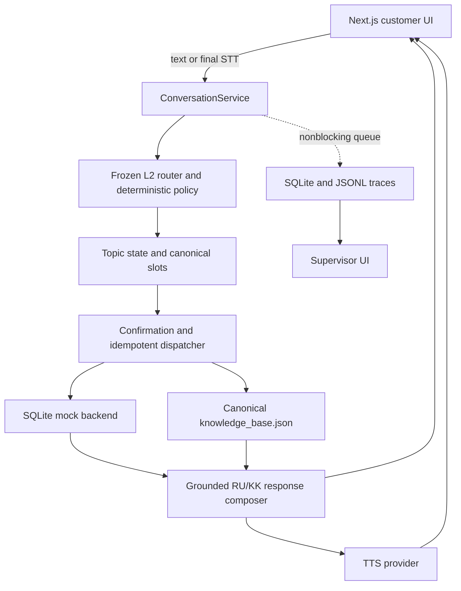

# Halyk CallAI — working text + voice demo

Halyk-style insurance assistant over the **fictional Saqta Insurance starter kit**. All business operations are local mock executions. Official dataset and evaluator are unchanged. Architecture remains locked by `../BUILD_SPEC.md`.

## Start on Windows

Requirements: Python 3.12+, Node.js 20.9+ and npm. From `halyk-callai`:

```powershell
.\scripts\run.ps1 demo
```

The command installs constrained Python dependencies, installs frontend dependencies if missing, builds Next.js, and starts the backend and frontend. Open **http://127.0.0.1:3000**, supervisor **http://127.0.0.1:3000/supervisor**. Default `.\scripts\run.ps1` does the same. Ctrl+C stops the child backend. The application is deliberately bound to loopback, with one backend worker.

Set your key locally in `.env`. Keep **CALLAI_MODEL=gpt-6-astra**: L2 is locked; production startup rejects a different routing model. No key is included in source or snapshots. `/ready` indicates configuration, not verified provider access.

```powershell
.\scripts\run.ps1 test
.\scripts\run.ps1 validate
.\scripts\run.ps1 compile
.\scripts\run.ps1 baseline
.\.venv\Scripts\python scripts\live_acceptance.py
.\.venv\Scripts\python scripts\voice_probe.py
```

The last two commands require a running backend and make real paid provider requests. Baseline runs the original 104 official examples and unchanged official scorer. Do not generate a large synthetic corpus.

## Measured results — 23 September 2026

- **Frozen L2 regression after integration:** primary and full-match **104/104**, multi-intent recall **26/26**. Router mean **8.254 s**, P95 **13.130 s**. Zero final schema/API/system-intent failures; one successful schema repair. [Report](evaluation/integration-final-astra/baseline.md), [official scorer](evaluation/integration-final-astra/20260923T111919_964539Z/official_stdout.txt).
- **Boundary probe:** PASS, CLARIFY, no action permission. [Actual result](evaluation/results/boundary_probe_20260923T112357_236619Z/result.json).
- **131 backend tests**, **1 browser-playback unit test** passed. Dataset validation, compileall, pip check, production frontend build, HTTP smoke and actual Windows startup executed successfully.
- **Six live text acceptance paths:** PASS; **12 actual turns**, average complete text turn **7.899 s**, including router, policy, actions and response composition. [Recorded requests/responses](evaluation/product-acceptance/turns.json), [assertion results](evaluation/product-acceptance/results.json).
- **Live voice API round trips:** RU **11.03 s**, KK **9.79 s**, from recorded audio upload through final synthesized response. Includes STT, chat and TTS; excludes the time a human spends speaking and playback duration. [Probe](evaluation/voice-probe/results.json). Input fixtures were generated speech, not recordings of a human microphone. RU/KK output MP3s are in that directory.
- Customer and supervisor pages were exercised through a real browser. The supervisor displayed actual evidence, missing boundary, exact turn source, dialogue action and measured timing.

These are reused development-set results, not independent hidden-test accuracy or a production SLO. Test fixtures never replace official predictions.

## Golden L2 preservation

`golden/L2/` preserves the exact original source, dataset hashes, configuration and evaluation artifacts. `golden/L2/LOCK.json` records **16 protected source hashes**, model, reasoning and cache options. All protected files match, verified by `test_golden.py` and [verification artifact](evaluation/golden-verification.json). L3/L4 are not used; the stopped L4 partial run remains explicitly marked incomplete.

During integration a local `.env` override selected `gpt-6-luna`. That diagnostic run scored 99/104 full-match, 23/26 recall; it is preserved in `evaluation/integration-final/` and **is not L2**. Restoring the authorized golden model to `gpt-6-astra`, without changing prompt/policy/contracts, restored 104/104. The related initial failed live dialogues are retained under `evaluation/product-acceptance-luna-diagnostic/`.

## Architecture



B6–B9: persistent sessions, full history, stack and unresolved tasks; scoped slots with provenance and correction history; canonical action inputs/results, backend verification, preview, explicit confirmation bound to operation/parameters/topic/version; transactionally persisted operation ledger; direct KB retrieval with source pointers. All 31 canonical mock actions have execution and replay tests.

B10–B12: trace queue does not await storage on the response path. Traces include state before/after, attributable evidence and supersession, boundaries, actions, KB citations, retries, errors and stage timings. Supervisor polls actual API records. Critical tests cover corrections, SWITCH/RESTORE, retained secondary intents, missing parameters, stale versions, duplicate requests/operations, service failures and voice degradation.

B13–B14: isolated STTProvider/TTSProvider interfaces; browser MediaRecorder sends only a stopped/final utterance. STT text goes through the same `/api/chat`. RU/KK selection supplies a transcription hint. TTS reads only a committed response. Starting the microphone stops playback; generation tokens reject late stale audio. Interruption events preserve committed state. Optional Pipecat bridge is included but the Pipecat package/transport was not installed or tested; the working demo uses the browser final-utterance transport requested in the latest task.

## Six demo shortcuts

Click a shortcut to create a new conversation and send a real request. For multi-turn shortcuts click **Следующая реплика демо**. Confirmations execute only after the explicit **Подтвердить** button.

1. **Найти офис:** canonical Almaty address and hours.
2. **Деньги списали:** ambiguous mixed-language query → clarification → supplied phone/date → actual failed-payment record and mock handoff.
3. **Исправить сведения:** first email → corrected email; old evidence superseded and confirmation replaced.
4. **Вернуться к теме:** cancellation preview → office interruption → RESTORE with original policy and reason.
5. **Подтвердить действие:** change demo email, inspect preview, confirm exactly once. C001 IIN is a fictional provided test identifier.
6. **Қазақша сөйлесейік:** Kazakh office request and response.

Open the supervisor link from the current conversation. Select earlier turns to see their committed state and evidence. Voice requires microphone permission in the browser; use RU/KK before recording. Press the microphone again to finish the utterance. Audio is AI generated.

## Configuration, persistence and limits

- Runtime state: `runtime/callai.sqlite`; JSONL: `runtime/callai.events.jsonl`; server logs: `backend/runtime/`. All ignored by git. `CALLAI_DATABASE` may select another local SQLite file. Restart preserves sessions and mock mutations.
- `CALLAI_VOICE_ENABLED=false` disables voice while text/supervisor remain available. Missing audio credentials does not prevent app startup. `CALLAI_VOICE_API_KEY`/`CALLAI_VOICE_BASE_URL` optionally override shared OpenAI credentials; STT defaults to whisper-1, TTS to gpt-4o-mini-tts/coral. Audio settings can be set in `.env` or environment.
- Reference date is the official **2026-10-01**. Original data stays read-only; execution mutates its local persisted copy. SMS/email/callback/handoff actions record an outbox entry, not external delivery. Newly created/renewed policies are pending payment, never falsely reported active.
- OGPO quote defaults to the provided 12-month formula; CASCO quote uses Standard. No amendment tariff is supplied, so extra premium remains unknown. Travel country classification supports listed common countries; unsupported countries request verification rather than inventing a tariff.
- The kit contains locations but no appointment calendar. Booking uses a clearly simulated weekday 09:00–16:00 schedule with persistent reservations. No real clinic or inspection appointment is booked.
- Local demonstration only: no production authentication, identity proofing, external payment system, production availability calendar or delivery provider. Customer IDs are lookup data, not authentication. Do not expose these local supervisor endpoints publicly.
- A human microphone/speaker test and independent multi-speaker/noisy Kazakh speech benchmark remain unverified. The executed voice probe is only two generated utterances; it does not establish speech accuracy broadly.
- No routing latency optimization was introduced in this phase. Customer composition uses a separate grounded model call only when deterministic templates are insufficient; its latency/call count are separate from L2.

Official API references: [speech transcription](https://developers.openai.com/api/docs/guides/speech-to-text), [speech synthesis](https://developers.openai.com/api/docs/guides/text-to-speech).

## Files changed in the product build

Restored to golden: `backend/app/router/`, `policy/`, `catalog/`, `config/` (hash-preserved after restoration). Runtime model restored in ignored `.env`; key untouched.

Added: `backend/app/state/`, `slots/`, `actions/`, `kb/`, `response/`, `observability/`, `voice/`; `frontend/` (Next.js, TypeScript, Tailwind, lockfile, playback test); action/conversation/voice/golden tests; `scripts/live_acceptance.py`, `scripts/voice_probe.py`; `golden/L2/`; evaluation and acceptance artifacts.

Updated: `backend/app/main.py`, `scripts/run.ps1`, `.env.example`, `.gitignore`, this README and BUILD_LOG. Official gold, evaluator and canonical data were not changed. Earlier B5 history remains in `evaluation/BASELINE_NOTES.md` and timestamped results.
